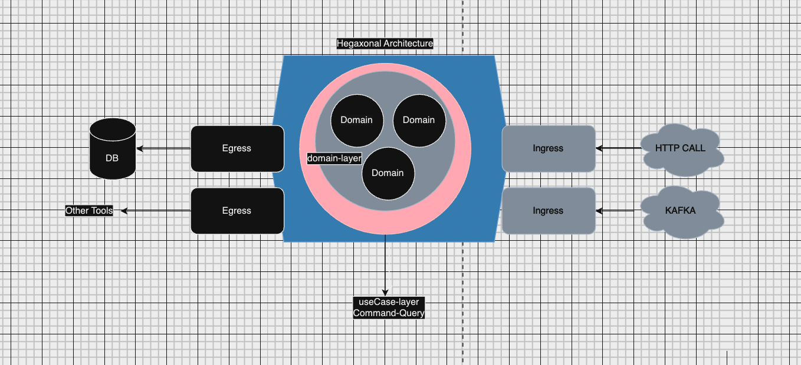

<!-- This is the README DOC -->
# Nest DDD Template
Hexagonal Template + Technical DDD + concurrency Handling + Data persistance per aggregate
## Description

I tried to provide Template based on hexagonal architecture (port/adapter) the reason that i choose this pattern 
is can be one of candidates for meet clean architecture requirements and under the hood we can implement separation of concerns for each layer: 

, we have 4 different layers here
- egress: is the layer that we map outbound like data persistance  
  - this layer is equal to infrastructure layer in DDD
- ingress [inspired by kubernetes ingress ] is the layer that we bounding port to the 
  - this layer is equal to ui | user-interface layer in DDD
- useCase: this layer is responsible for validation and authentication / authorization
   - this layer is equal to application layer in DDD
- domain main domain logic will be applied here

## Architecture

As you find out the main purpose of this Repo is to provide valid Template for Technical DDD
with combination of Hexagonal architecture as much as possible, some important notes are here

- Data persistance will be in document persistance per aggregate on mongodb
- For managing optimistic concurrency i used versioning here
- For Authentication simple authentication has been used
- In UseCase layer i separated read/write services in future can be easier for manage, even for read we don't need access to domain and get data directly from egress and aggregate it based on requirements or even we may have domain for read data ?!

- Swagger for http egress applied
- APIs and core domain logic covered by e2e and unit test
- Service has been dockerized and you can find mongodb from docker-compose
- Do not forget to create .env file from .env.example


<!-- image -->



## Help
- Service is running in 3000 port
- You can find swagger in localhost:3000/api

## Installation

```bash
$   npm install
```

## Running the app

```bash
# development
$ npm run start

# watch mode
$ npm run start:dev

# production mode
$ npm run start:prod
```

## Running the app with dockerFile

```bash
# development
$ docker build -t your-app-name .

# Run the Docker container, making sure to map port 3000 on your host to the exposed port
$ docker run -p 3000:3000 -d your-app-name 
$ docker run -p 3000:3000 -d -v /path/to/your/.env:/app/.env your-app-name

# or for run with docker-compose
# do not forget --build flag if you provide changes!
$ docker-compose up
```

## Test

```bash
# unit tests
$ npm run test

# e2e tests - before run the e2e test please run the app separately
$ npm run test:e2e

# test coverage 
$ npm run test:cov
```
